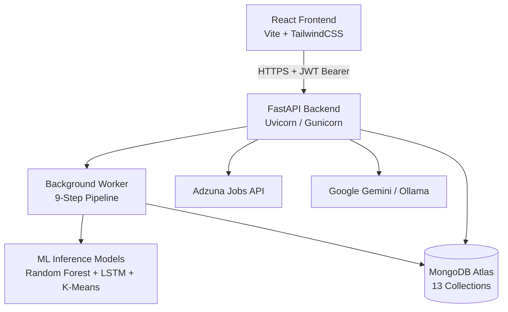
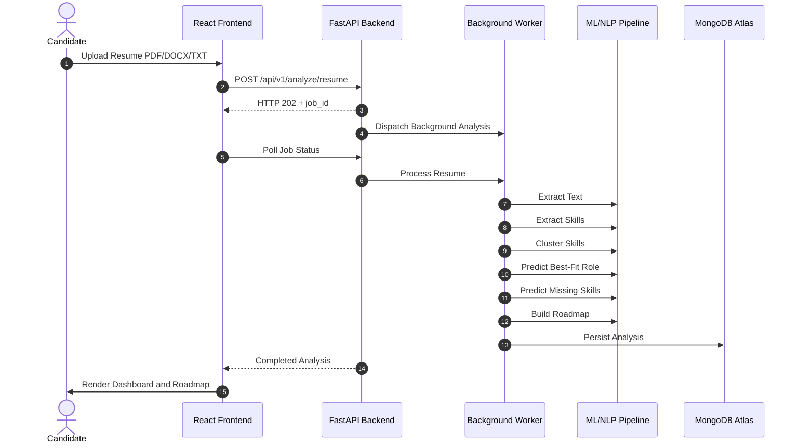

# AI Skill Gap Analyzer

> **Google Maps for Career Development** — Upload your resume, discover your skill gaps, and get a personalized AI-powered roadmap to your dream role.

---

## 📌 Overview

**AI Skill Gap Analyzer** is a full-stack career intelligence platform designed to bridge the gap between a candidate's current skills and the skills required for their target industry role.

The platform analyzes uploaded resumes, extracts technical skills, predicts suitable job roles, identifies missing competencies, evaluates job readiness, generates personalized learning roadmaps, and provides real-time career market intelligence.

### Problem It Solves

Job seekers often struggle to:

* Identify the exact technical skills missing from their resume.
* Understand which roles best match their existing skill set.
* Determine their readiness for a target job.
* Find relevant learning resources for missing skills.
* Understand current job-market demand and salary trends.
* Benchmark their skills against other candidates.
* Practice interviews based on their actual skill gaps.

### Purpose & Value

The platform combines **NLP, Machine Learning, LLMs, market intelligence, GitHub analysis, and gamification** to provide an end-to-end career development experience.

It can:

* Extract and categorize skills from resumes.
* Predict suitable technical roles.
* Identify high-priority missing skills.
* Generate personalized learning roadmaps.
* Analyze live job-market demand.
* Compare readiness against peer percentiles.
* Conduct AI-powered mock interviews.
* Analyze public GitHub activity.
* Track learning progress through XP, levels, streaks, and badges.

---

## ✨ Key Features

### 📄 Resume Parsing & Skill Extraction

* Supports **PDF, DOCX, and TXT** resumes.
* Uses **SpaCy NLP** for pattern-based skill extraction.
* Uses **SentenceTransformers (`all-MiniLM-L6-v2`)** for semantic similarity.
* Uses **Tesseract OCR** as a fallback for scanned documents.

### 🤖 ML-Based Role & Skill Gap Prediction

* Predicts suitable roles across **50+ technical job roles**.
* Uses a **Random Forest classifier** for role prediction.
* Uses a **multi-input LSTM neural network** to identify missing skills.
* Ranks the **top 15 missing skills** for the selected role.

### 📊 Job Readiness Scoring

Evaluates candidate readiness across three experience tiers:

* Beginner / Fresher
* Intermediate / Experienced
* Advanced / Professional

### 🎯 Dynamic Role Skill Resolution

Required skills for a role can be resolved through multiple sources:

1. MongoDB
2. Built-in skill tables
3. Google Gemini
4. Adzuna job-market data
5. Standard fallback skill sets

### 🗺️ Personalized Learning Roadmaps

Generates sequential learning paths based on missing skill priority.

Learning resources can include:

* Coursera courses
* YouTube resources

### 📈 Live Market Intelligence

Uses the **Adzuna Jobs API** to provide:

* Job demand scores
* Salary ranges
* INR/USD compensation information
* Six-month historical trends
* Remote / hybrid / onsite distribution
* Top hiring companies

### 👥 Peer Benchmarking

Candidates can compare readiness against platform-wide:

* P25 percentile
* P50 percentile
* P75 percentile

Benchmarking can be performed across up to **five roles simultaneously**.

### 🔔 Market Demand Alerts

The system can generate automated notifications when subscribed role demand changes by **10% or more**.

### 🎤 Conversational AI Mock Interviews

Provides interactive technical interviews based on detected skill gaps.

Supported AI providers include:

* Google Gemini
* Ollama

Supported local models include:

* `llama3.2`
* `mistral`
* `codellama`

### 🐙 GitHub Profile Enrichment

The platform can synchronize public GitHub repositories and map repository languages and topic tags to canonical skills.

GitHub skills are combined with resume-derived skills through a deduplicated union.

### 🎮 Gamification

Tracks career preparation using:

* XP system
* 10 progression levels
* Daily activity streaks
* Milestone history
* Domain mastery
* Achievement badges

---

# 🏗️ System Architecture



---

# 🛠️ Tech Stack

| Category                   | Technologies                                                                 |
| -------------------------- | ---------------------------------------------------------------------------- |
| **Frontend**               | React 19, Vite, TailwindCSS v4, Recharts, Framer Motion                      |
| **Backend API**            | Python 3.10+, FastAPI, Uvicorn, Gunicorn, SlowAPI                            |
| **Database**               | MongoDB with Motor async driver                                              |
| **Machine Learning**       | scikit-learn, Random Forest, K-Means, PCA, TensorFlow/Keras, LSTM            |
| **NLP & Document Parsing** | SpaCy, SentenceTransformers, PyMuPDF, PDFPlumber, python-docx, Tesseract OCR |
| **AI / LLM**               | Google Gemini API, Ollama                                                    |
| **External APIs**          | Adzuna Jobs API, GitHub API                                                  |
| **Authentication**         | JWT HS256, Google OAuth2, GitHub OAuth2, Supabase OTP                        |
| **Task Scheduling**        | APScheduler                                                                  |
| **Monitoring**             | Sentry SDK                                                                   |
| **Deployment**             | Docker, Vercel, Render / AWS App Runner                                      |

---

# 📂 Project Structure

```text
AI-Skills-Gap-Analyzer/
│
├── backend/
│   ├── main.py
│   ├── worker.py
│   ├── ml_inference.py
│   ├── ml_loader.py
│   ├── models.py
│   ├── database.py
│   ├── security.py
│   ├── Dockerfile
│   ├── requirements.txt
│   │
│   ├── nlp/
│   │   ├── engine.py
│   │   ├── semantic.py
│   │   ├── pdf_processor.py
│   │   ├── docx_processor.py
│   │   ├── llm_providers.py
│   │   ├── llm_interview.py
│   │   └── interview_bank.py
│   │
│   ├── routes/
│   │   ├── auth.py
│   │   ├── jobs.py
│   │   ├── interview.py
│   │   ├── github.py
│   │   ├── market.py
│   │   ├── benchmark.py
│   │   ├── progress.py
│   │   ├── alerts.py
│   │   ├── readiness.py
│   │   ├── feedback.py
│   │   ├── models.py
│   │   ├── monitoring.py
│   │   └── user.py
│   │
│   ├── services/
│   │   ├── role_skills_service.py
│   │   ├── market_service.py
│   │   ├── benchmark_service.py
│   │   ├── progress_service.py
│   │   ├── mastery_service.py
│   │   ├── milestone_service.py
│   │   ├── alerts_service.py
│   │   ├── ai_interview_service.py
│   │   ├── oauth_service.py
│   │   ├── supabase_auth.py
│   │   ├── feedback_service.py
│   │   └── monitoring_service.py
│   │
│   └── models/
│       ├── ml_models/
│       │   └── v1.0/
│       │
│       └── ml_training/
│           ├── train_role_predictor.py
│           ├── train_missing_skills_lstm.py
│           ├── train_skill_clusterer.py
│           ├── find_optimal_k.py
│           ├── generate_skill_embeddings.py
│           ├── evaluate_models.py
│           └── versioning.py
│
└── frontend/
    ├── src/
    │   ├── App.jsx
    │   │
    │   ├── pages/
    │   │   ├── LandingPage.jsx
    │   │   ├── LoginPage.jsx
    │   │   ├── RegisterPage.jsx
    │   │   ├── ForgotPasswordPage.jsx
    │   │   ├── UploadPage.jsx
    │   │   ├── DashboardPage.jsx
    │   │   ├── MarketPage.jsx
    │   │   ├── ProfilePage.jsx
    │   │   └── OAuthCallbackPage.jsx
    │   │
    │   ├── components/
    │   │   ├── Navbar.jsx
    │   │   ├── InterviewPanel.jsx
    │   │   ├── GithubSync.jsx
    │   │   ├── InteractiveBackground.jsx
    │   │   ├── ProtectedRoute.jsx
    │   │   └── gamification/
    │   │       ├── XPBar.jsx
    │   │       ├── BadgeGrid.jsx
    │   │       └── StreakCard.jsx
    │   │
    │   ├── api/
    │   │   ├── base.js
    │   │   ├── auth.js
    │   │   ├── github.js
    │   │   ├── progress.js
    │   │   └── user.js
    │   │
    │   └── context/
    │       └── AuthContext.jsx
    │
    └── vercel.json
```

---

# ⚙️ Installation & Setup

## Prerequisites

| Tool          | Version / Requirement                       |
| ------------- | ------------------------------------------- |
| Node.js       | v18+                                        |
| Python        | 3.10+                                       |
| MongoDB       | Community Server or MongoDB Atlas           |
| Tesseract OCR | Optional; required for scanned PDF fallback |

---

## 1. Clone the Repository

```bash
git clone https://github.com/Avni7719/AI-Skills-Gap-Analyzer.git
cd AI-Skills-Gap-Analyzer
```

---

## 2. Backend Setup

Navigate to the backend directory:

```bash
cd backend
```

### Create a Virtual Environment

#### Windows

```bash
python -m venv venv
venv\Scripts\activate
```

#### macOS / Linux

```bash
python -m venv venv
source venv/bin/activate
```

### Install Dependencies

```bash
pip install -r requirements.txt
```

### Configure Environment Variables

Create your `.env` file based on the required environment variables.

If an `.env.example` file exists in the repository:

```bash
cp .env.example .env
```

For Windows PowerShell:

```powershell
Copy-Item .env.example .env
```

### Start the Backend

```bash
uvicorn main:app --reload
```

Backend endpoints:

* API: `http://127.0.0.1:8000`
* Swagger UI: `http://127.0.0.1:8000/docs`
* ReDoc: `http://127.0.0.1:8000/redoc`
* Health Endpoint: `http://127.0.0.1:8000/health`

---

# 3. Frontend Setup

Open a new terminal and navigate to the frontend:

```bash
cd frontend
```

Install dependencies:

```bash
npm install
```

Start the development server:

```bash
npm run dev
```

The frontend will be available at:

```text
http://localhost:5173
```

---

# 🐳 Running Backend with Docker

Navigate to the backend directory:

```bash
cd backend
```

Build the Docker image:

```bash
docker build -t ai-skill-gap-backend .
```

Run the container:

```bash
docker run -p 8080:8080 --env-file .env ai-skill-gap-backend
```

---

# 🔐 Environment Variables

Create a `.env` file inside the `backend/` directory.

| Variable               | Description                                                        |
| ---------------------- | ------------------------------------------------------------------ |
| `MONGO_URL`            | MongoDB connection string for local MongoDB or MongoDB Atlas       |
| `SECRET_KEY`           | Secret key used for signing JWT access and refresh tokens          |
| `ENVIRONMENT`          | Runtime mode such as `development` or `production`                 |
| `FRONTEND_URL`         | Frontend URL used for CORS configuration                           |
| `ML_MODEL_VERSION`     | Version directory for loaded ML artifacts, e.g. `v1.0`             |
| `ADMIN_API_KEY`        | Admin authorization key for updating and activating model versions |
| `GOOGLE_CLIENT_ID`     | Google OAuth2 client ID                                            |
| `GOOGLE_CLIENT_SECRET` | Google OAuth2 client secret                                        |
| `GITHUB_CLIENT_ID`     | GitHub OAuth2 client ID                                            |
| `GITHUB_CLIENT_SECRET` | GitHub OAuth2 client secret                                        |
| `OAUTH_REDIRECT_BASE`  | Base backend callback domain for OAuth                             |
| `SUPABASE_URL`         | Supabase endpoint URL for OTP validation services                  |
| `SUPABASE_SERVICE_KEY` | Supabase service role key                                          |
| `LLM_PROVIDER`         | LLM provider selection: `gemini` or `ollama`                       |
| `GEMINI_API_KEY`       | Google Gemini API key                                              |
| `OLLAMA_BASE_URL`      | Ollama server URL, e.g. `http://localhost:11434`                   |
| `OLLAMA_MODEL`         | Ollama model name such as `llama3.2`                               |
| `ADZUNA_APP_ID`        | Adzuna application ID                                              |
| `ADZUNA_APP_KEY`       | Adzuna application key                                             |
| `ADZUNA_COUNTRY`       | Geographic target code such as `in` or `us`                        |
| `GITHUB_TOKEN`         | Optional GitHub token for higher API rate limits                   |
| `SENTRY_DSN`           | Optional Sentry DSN for exception monitoring                       |
| `LOG_LEVEL`            | Application logging level such as `INFO` or `DEBUG`                |

> **Security:** Never commit `.env` files, API keys, OAuth secrets, JWT secrets, or service-role credentials to GitHub.

---

# 🚀 Usage

## 1. Register / Sign In

Create an account using:

* Email OTP through Supabase
* Google OAuth
* GitHub OAuth

## 2. Upload Your Resume

Navigate to the upload section and provide a:

* PDF
* DOCX
* TXT

resume.

The user can allow the system to automatically detect a suitable target role or select from the predefined roles.

GitHub can also be connected to enrich the detected skill profile.

## 3. Analyze Your Dashboard

The dashboard provides:

* Detected skills
* Missing skills
* Job readiness level
* Personalized learning roadmap
* Skill-domain information

## 4. Explore Market Intelligence

The market section provides information such as:

* Job demand
* Salary trends
* Historical market trends
* Work-mode distribution
* Hiring companies
* Peer benchmarks

## 5. Practice AI Mock Interviews

Start a conversational technical interview based on the skills and gaps identified from your profile.

## 6. Track Your Progress

Users can track:

* XP
* Levels
* Streaks
* Domain mastery
* Milestones
* Achievement badges

---

# 🔄 How It Works



---

# 🤖 AI / ML Architecture

## 1. Skill Extraction & Semantic Matching

### Technologies

* SpaCy `en_core_web_sm`
* SentenceTransformers `all-MiniLM-L6-v2`
* PyMuPDF
* python-docx
* Tesseract OCR

### Process

1. Extract text from the uploaded resume.
2. Use OCR when required for scanned documents.
3. Identify potential skills using NLP.
4. Compare extracted terms against canonical skill libraries.
5. Use semantic similarity to identify related skills.

---

## 2. Role Prediction

### Algorithm

**Random Forest Classifier**

### Scope

50+ predefined technical job roles.

### Input

Vectorized candidate skill representation.

### Reported Performance

**98.4% test accuracy**

---

## 3. Missing Skill Prediction

### Architecture

**Multi-input LSTM neural network**

### Inputs

* Extracted candidate skill sequences
* Target role
* Seniority metadata

### Output

A ranked list of the **top 15 missing skills** required for the selected target role.

---

## 4. Skill Domain Clustering

### Algorithms

* K-Means Clustering
* Principal Component Analysis (PCA)

### Skill Domains

Skills are grouped into operational categories such as:

* Frontend
* Backend
* DevOps
* Data

### Reported Performance

**Silhouette score > 0.6**

---

# 🔌 API Documentation

All API routes are served under the:

```text
/api/v1
```

---

## 🔐 Authentication

| Method | Endpoint                  | Description                                 |
| ------ | ------------------------- | ------------------------------------------- |
| `GET`  | `/auth/google/login`      | Redirect to Google OAuth consent            |
| `GET`  | `/auth/google/callback`   | Handle Google OAuth callback and return JWT |
| `GET`  | `/auth/github/login`      | Redirect to GitHub OAuth consent            |
| `GET`  | `/auth/github/callback`   | Handle GitHub OAuth callback                |
| `POST` | `/auth/signup/send-otp`   | Send registration OTP                       |
| `POST` | `/auth/signup/resend-otp` | Resend registration OTP                     |
| `POST` | `/auth/signup/verify-otp` | Verify registration OTP and create user     |
| `POST` | `/auth/signin`            | Sign in using email/password                |
| `POST` | `/auth/password/forgot`   | Dispatch password reset OTP                 |
| `POST` | `/auth/password/reset`    | Reset account password                      |
| `POST` | `/auth/refresh`           | Rotate access tokens                        |
| `POST` | `/auth/logout`            | Revoke active refresh token                 |

---

## 📄 Resume Analysis

| Method | Endpoint               | Description                                |
| ------ | ---------------------- | ------------------------------------------ |
| `POST` | `/analyze/resume`      | Submit resume for analysis                 |
| `GET`  | `/jobs/{job_id}`       | Retrieve background analysis status        |
| `GET`  | `/history`             | Fetch resume analysis history              |
| `POST` | `/predict-role`        | Predict role from provided skills          |
| `POST` | `/interview-questions` | Generate role-targeted interview scenarios |
| `POST` | `/analyze/github`      | Enrich profile using GitHub activity       |

---

## 📈 Market & Benchmarking

| Method | Endpoint                            | Description                                    |
| ------ | ----------------------------------- | ---------------------------------------------- |
| `GET`  | `/market/demand?role=`              | Retrieve demand, salary, and historical trends |
| `GET`  | `/market/roles`                     | List tracked market roles                      |
| `POST` | `/market/refresh`                   | Refresh Adzuna job data                        |
| `GET`  | `/market/companies?role=`           | List top hiring companies                      |
| `GET`  | `/market/work-modes?role=`          | Retrieve work-mode distribution                |
| `GET`  | `/market/benchmarks?role=`          | Retrieve peer percentiles                      |
| `GET`  | `/market/benchmarks/compare?roles=` | Compare up to five roles                       |

---

## 🎮 Progress & Gamification

| Method | Endpoint                    | Description                            |
| ------ | --------------------------- | -------------------------------------- |
| `GET`  | `/user/progress`            | Retrieve XP, level, streak, and badges |
| `POST` | `/user/progress/complete`   | Record completed activity and award XP |
| `GET`  | `/user/progress/actions`    | List progression actions               |
| `GET`  | `/user/progress/domains`    | Retrieve domain mastery                |
| `GET`  | `/user/progress/milestones` | Retrieve milestone history             |
| `GET`  | `/user/badges`              | Retrieve earned and locked badges      |
| `POST` | `/user/badges/check`        | Evaluate badge criteria                |

---

## 🎤 Mock Interview & Support

| Method   | Endpoint                               | Description                         |
| -------- | -------------------------------------- | ----------------------------------- |
| `POST`   | `/mock-interview/start`                | Start an AI mock interview          |
| `POST`   | `/mock-interview/{session_id}/respond` | Submit an interview response        |
| `POST`   | `/user/alerts/subscribe`               | Subscribe to market alerts          |
| `DELETE` | `/user/alerts/unsubscribe`             | Unsubscribe from market alerts      |
| `GET`    | `/user/alerts`                         | List market alerts                  |
| `GET`    | `/readiness/levels?role=`              | Retrieve readiness criteria         |
| `GET`    | `/models`                              | List ML model versions              |
| `POST`   | `/models/activate/:version`            | Activate a model version            |
| `GET`    | `/monitoring/health`                   | Retrieve ML health and drift status |
| `POST`   | `/feedback`                            | Submit analysis feedback            |

---

# 📊 Results & Performance

| Component                | Reported Result                 |
| ------------------------ | ------------------------------- |
| Role Predictor           | **98.4% test accuracy**         |
| Skill Clusterer          | **Silhouette score > 0.6**      |
| Role Coverage            | **50+ technical roles**         |
| Missing Skill Prediction | **Top 15 missing skills**       |
| Skill Domains            | Frontend, Backend, DevOps, Data |

> Performance figures above are the reported project evaluation results.

---

# 🔮 Future Enhancements

Potential future improvements include:

* Expanding the role and skill knowledge base.
* Adding additional job-market data providers.
* Improving personalized learning recommendations.
* Expanding AI mock interview capabilities.
* Adding more career progression analytics.
* Increasing the number of supported technical roles.
* Enhancing model monitoring and evaluation.
* Adding additional integrations with professional platforms.

---

# 🤝 Contributing

Contributions are welcome.

### 1. Fork the Repository

Fork the project on GitHub.

### 2. Create a Feature Branch

```bash
git checkout -b feature/your-feature-name
```

### 3. Make Your Changes

Implement and test your changes locally.

### 4. Commit Your Changes

```bash
git commit -m "Add: your feature description"
```

### 5. Push Your Branch

```bash
git push origin feature/your-feature-name
```

### 6. Open a Pull Request

Create a Pull Request with a clear description of your changes.

---

# 📄 License

License information has not been specified yet.

---

# 👨‍💻 Author

**Avni**

* GitHub: https://github.com/Avni7719

---

# ⭐ Support

If you find **AI Skill Gap Analyzer** useful, consider giving the repository a ⭐ on GitHub.

Your support helps the project grow and encourages further development.

---
